# Sandwich Maker and Delivery System
Automatic sandwich maker and delivery robot, all through Amazon Alexa.

**ECE 4180 Embedded Systems Design (Fall 2016)**

* Jeremy Cai - TODO: EMAIL HERE
* Kairi Kozuma - kkozuma3@gatech.edu
* Vuong Tran - TODO: EMAIL HERE

## Introduction
This project is an automatic sandwich maker and delivery robot.
TODO: MORE INTRODUCTION INFO

## Features

* Use voice to order sandwiches via Alexa
* Cancellation and status checking of orders via Alexa
* Sandwich maker to automatically dispense bread and ingredients
* Delivery robot to deliver sandwich to destination given via Alexa
* Return of delivery robot to sandwich dispenser
* Synchronization of data between Alexa interaction, sandwich dispenser, and delivery robot


## Parts
1. [Amazon Dot](https://www.amazon.com/All-New-Amazon-Echo-Dot-Add-Alexa-To-Any-Room/dp/B01DFKC2SO)
2. [iRobot Create 2](http://www.irobot.com/About-iRobot/STEM/Create-2.aspx)
3. [mbed LPC1768](https://developer.mbed.org/platforms/mbed-LPC1768/)
4. 4 x [Voss Bottle](https://www.amazon.com/VOSS-Artesian-Water-Plastic-Bottles/dp/B002EM2J06/ref=pd_bxgy_325_3?_encoding=UTF8&pd_rd_i=B002EM2J06&pd_rd_r=F428FAC6MR1H7VTJJ12T&pd_rd_w=UQdBr&pd_rd_wg=rQnCA&refRID=F428FAC6MR1H7VTJJ12T&th=1)
5. 4 x Servos (for ingredients) [HK 15298 Used](https://hobbyking.com/en_us/hobbykingtm-hk15298-high-voltage-coreless-digital-servo-mg-bb-15kg-0-11sec-66g.html)
6. 1 x Servo (for bread) [Towerpro MG996R Used](https://hobbyking.com/en_us/towerpro-mg996r-10kg-servo-10kg-0-20sec-55g.html)
7. External Power Supply (TODO: Power supply link)
8. External Power Supply Barrel Jack (TODO: LINK)
9. 2 PCs (1 for mbed sandwich server, 1 for delivery robot)
10. Wood/Cardboard for SandwichMaker Frame

* Make sure that the ground of the servo and mbed are connected.

# Installation Instructions

Installation has the following major steps:

1. [Alexa Skill Setup](#amazon_skill_setup)
2. [Sandwich Maker Mbed and Server Code](#sandwich_maker_server)
3. [Roomba Create 2 C# Application](#roomba_create_robot)

## 1. <a name="amazon_skill_setup"></a>Amazon Skill Setup

To take sandwich orders using the Amazon Dot, a custom Alexa Skill is necessary. The skill defines the invocation phrase, interaction methods, and the arguments passed. This project uses three different Amazon services to take and manage orders.

* Note that you will need an [Amazon Developer Account](https://developer.amazon.com/) to access these services.

### 1.1 Amazon DynamoDB
To store and synchronize sandwich order data between the Amazon Dot (Alexa Skill), sandwich maker, and delivery robot, and DynamoDB database will be used. Amazon DynamoDB is a NoSQL Cloud Distributed Database service.

1. Access the [DynamoDB Portal](https://console.aws.amazon.com/dynamodb/home?region=us-east-1#) and click "Create Table".

	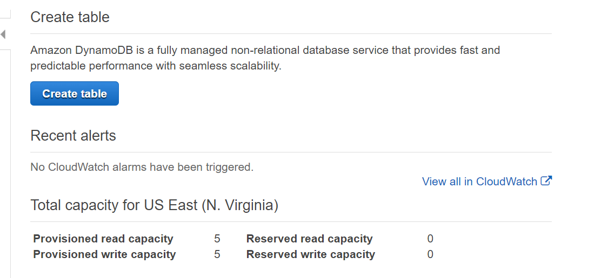

2. Name the table "Orders" and use "CustomerId" as the primary key of type "String". Leave the other settings as default. Click "Create".

	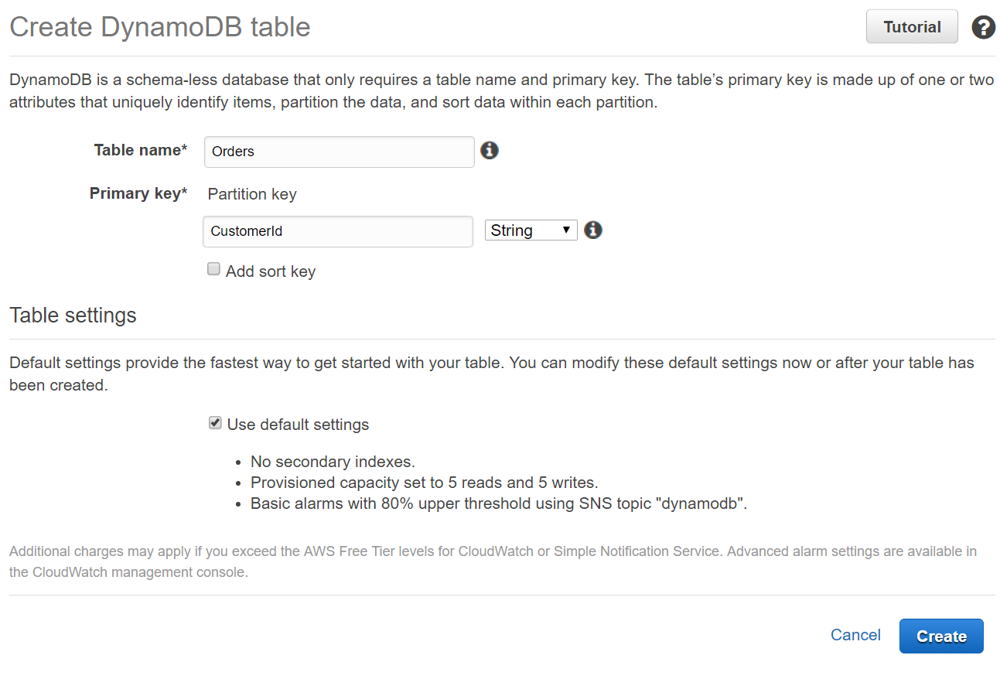

3. To enable access to the database from the lambda function (which will be implemented later), it is necessary to create a user. A user provides an ID and password to access certain resources.

	Go to the [IAM Console](https://console.aws.amazon.com/iam/home#/home) and click on the "Users" tab to the left. Click "Add user" to create a new user.
	
	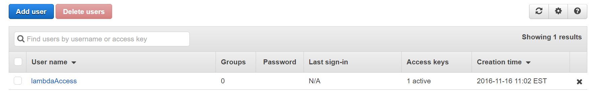
	
	Fill out the "User name" as shown and select "Programmatic access" for Access type. Then click "Next".
	
	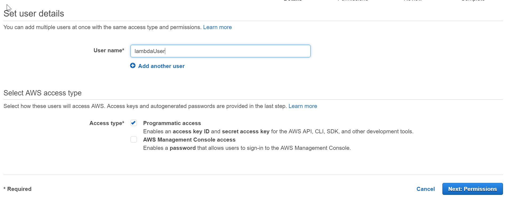
	
	Select "Attach existing policies directly" and search for "dynamodb" in the search box. Select "AmazonDynamoDBFullAccess" and "AmazonDynamoDBFullAccesswithDataPipeline". This will allow the lambda function to read and write from the database. Click "Next".
	
	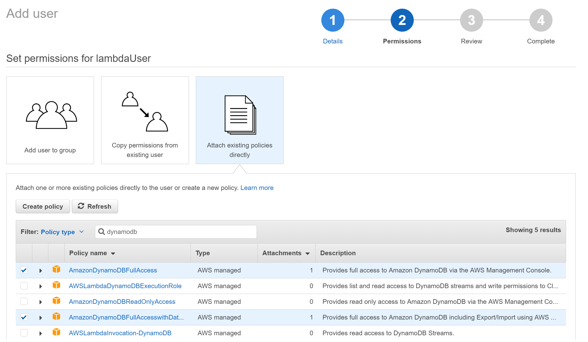

	Review user details and click "Create user".
	
	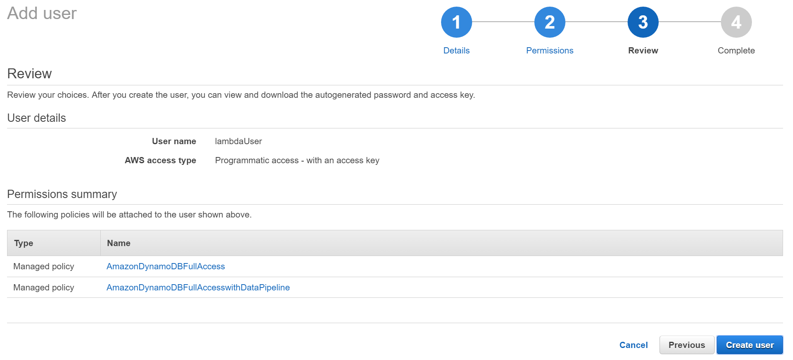
	
	After creating the user, the following is displayed. Copy down the "Access key ID" and "Secret access key". 
	
	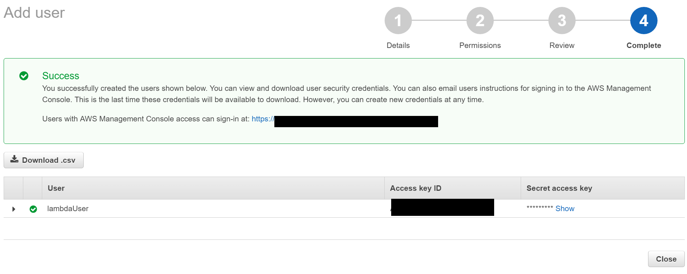
	
	**This is the only time these credentials are shown.**

### 1.2 Amazon Lambda Response
A lambda function will be used to insert and delete orders from the database. This function handles data passed from the Alexa Skill. The Alexa skill to be created later will send JSON information to the lambda.

1. Access the [Lambda Function Site](https://console.aws.amazon.com/lambda/home?region=us-east-1) from the Amazon Developer portal.

2. If no lambda functions exist, the following page should appear. Click on the "Get Started" button.

 	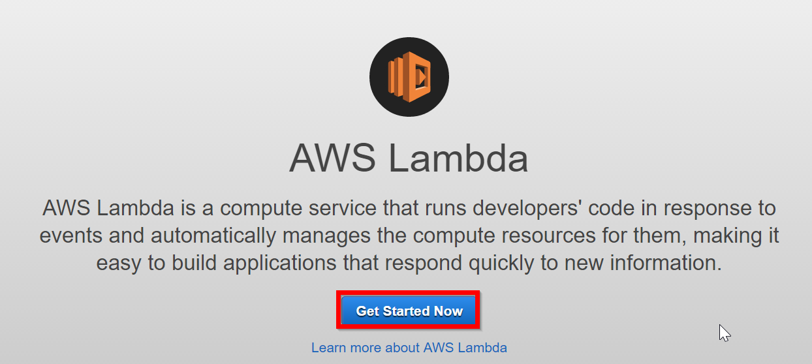

	If some lambda function exist, the following should appear. Click on the "Create a Lambda function" button.
     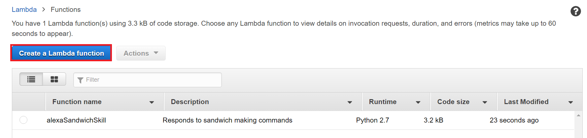

3. Select "Python" as the runtime library and search "Alexa" for blueprint template. Click on the template that appears.

	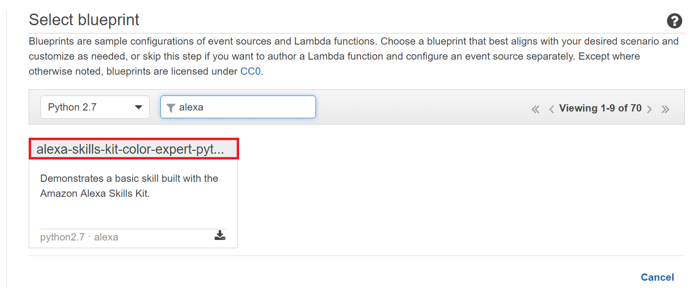

4. The trigger should default to Alexa. Click "Next".

	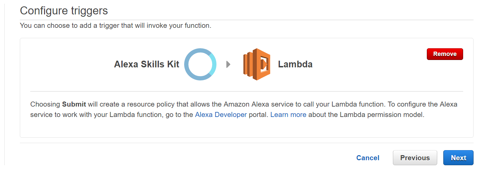

5. Name the function as shown in the screenshot below. Input an appropriate description for the lambda function. Choose "Upload a .ZIP file" as Code entry type and upload the "alexaOrderSkill.zip" file from the `src/lambda_function` directory.

	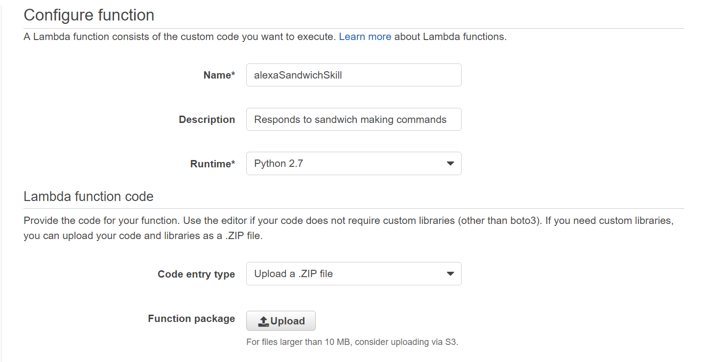

6. Choose a role for the Lambda function. This defines the permissions that the function has (the resources it can access within Amazon). Select "Create a custom role".

	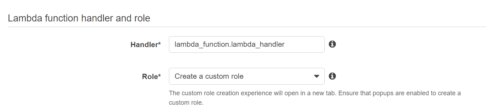

    A new window should open. This is the IAM console, which allows you to define new roles (with new permissions). Select "Create a new Role Policy" for the Policy Name and click the "Allow" button.

    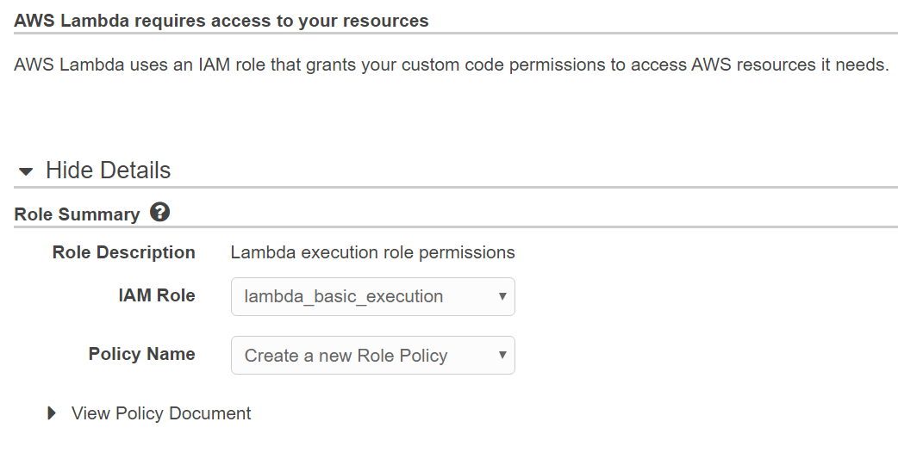

7. Review function details and confirm by clicking "Create function".

    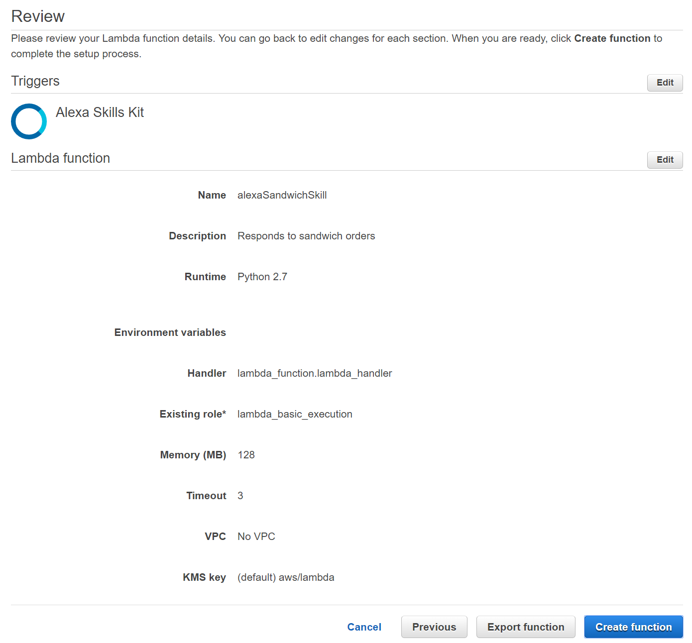

    The function should now appear in the list of functions (accessed from the "Functions" button on the left side).

    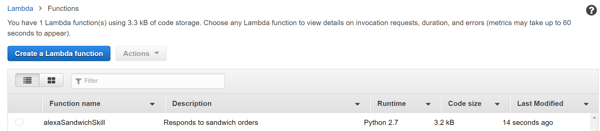

8. Click on the new function and record the ARN on the top right. This is necessary for the Alexa Skill to forward the data to the lambda function.

	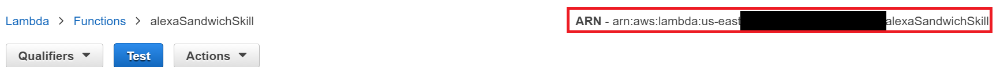

9. To access the database from the lambda function, change the access id key and password in the lambda function using the online code editor.

	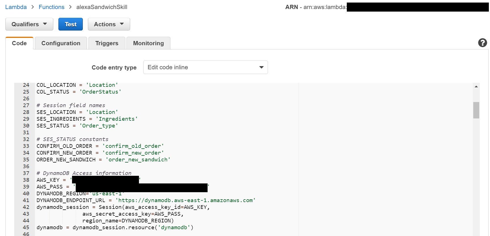

### 1.3 Alexa Skill

The following steps detail how to create the Amazon Alexa SandwichMaker skill. This will handle invocation of the skill and interaction methods with the voice user interface. The skill will pass data to the lambda function.

1. Go to the [Alexa Skill Portal](https://developer.amazon.com/edw/home.html#/). Click on "Alexa Skills Kit". Then click "Create New Skill".

	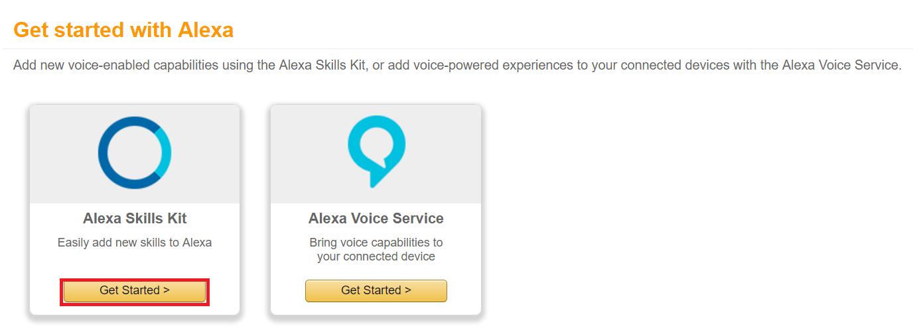
    ---

    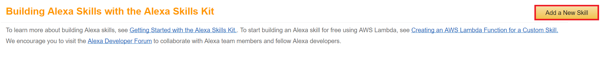

2. Fill in the information for the new Alexa skill as shown. Click "Next".

	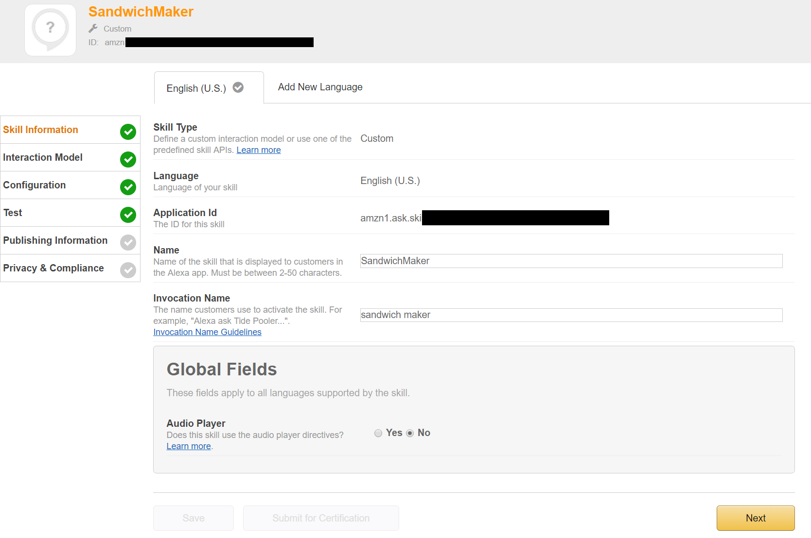

3. Copy and paste the intent schema below into the textbox for schema in the interaction model step.
	* Intents: types of interaction the skill can handle.
	
	**Intent Schema**
	
	```
	{
	  "intents": [
	    {
	      "intent": "OrderIntent",
	       "slots": [
	        {
	          "name": "OrderText",
	          "type": "ORDER_TEXT"
	        },
	        {
	          "name": "Location",
	          "type": "LOCATION"
	        }
	      	]
	    },
	    {
	      "intent": "CheckOrderIntent"
	    },
	    {
	      "intent": "AMAZON.HelpIntent"
	    },
	    {
	      "intent": "AMAZON.CancelIntent"
	    },
	    {
	      "intent": "AMAZON.NoIntent"
	    },
	    {
	      "intent": "AMAZON.YesIntent"
	    },
	    {
	      "intent": "AMAZON.StartOverIntent"
	    },
	    {
	      "intent": "AMAZON.StopIntent"
	    }
	  ]
	}
	```

	**Custom Slot Types**

	Since custom slot types are used, allowable values must be declared. Copy and paste the following 	values for the two slot types defined in the intent sche

	* Slots: arguments that are passed with intents.
	
	For LOCATION:
	
	```
	office
	kitchen
	bedroom
	dining room
	```
	
	For ORDER_TEXT:
	
	```
	lettuce
	tomatoes
	cheese
	onions
	```
	
	After inputting the intent schema and custom slot types, the page should appear like the one shown 	below.

	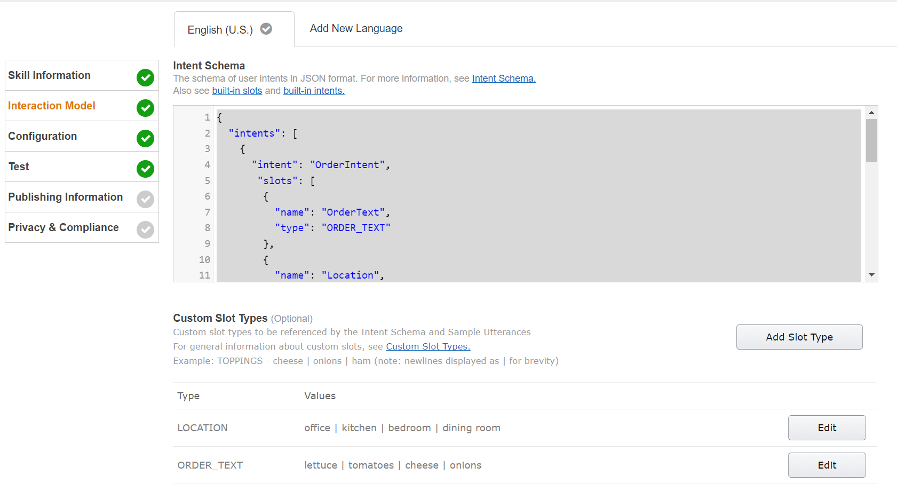

	**Sample Utterances**

	Sample utterances are ways to invoke the intents and pass arguments into slots as arguments. The format 	is `[INTENT] [some phrase {some slot type} more words {some slot type}]`.
	The sample utterances used for the sandwich maker is shown below. Copy and paste the utterances into 	the textbox for utterances.
	
	```
	OrderIntent make a sandwich with {OrderText} delivered to {Location}
	OrderIntent make a sandwich with {OrderText} and {OrderText} delivered to {Location}
	OrderIntent make a sandwich with {OrderText} {OrderText} and {OrderText} delivered to {Location}
	OrderIntent make a sandwich with {OrderText} {OrderText} {OrderText} and {OrderText} delivered to {Location}
	OrderIntent make me a sandwich with {OrderText} delivered to {Location}
	OrderIntent make me a sandwich with {OrderText} and {OrderText} delivered to {Location}
	OrderIntent make me a sandwich with {OrderText} {OrderText} and {OrderText} delivered to {Location}
	OrderIntent make me a sandwich with {OrderText} {OrderText} {OrderText} and {OrderText} delivered to {Location}
	OrderIntent I want a sandwich with {OrderText} delivered to {Location}
	OrderIntent I want a sandwich with {OrderText} and {OrderText} delivered to {Location}
	OrderIntent I want a sandwich with {OrderText} {OrderText} and {OrderText} delivered to {Location}
	OrderIntent I want a sandwich with {OrderText} {OrderText} {OrderText} and {OrderText} delivered to {Location}
	CheckOrderIntent what is my order
	CheckOrderIntent check order
	```
	* Note that `{OrderText}` is used multiple times in some utterances to capture multiple ingredients.

4. Select the endpoint as "AWS Lambda ARN" and input the ARN copied earlier from the lambda function. Click "Next".

	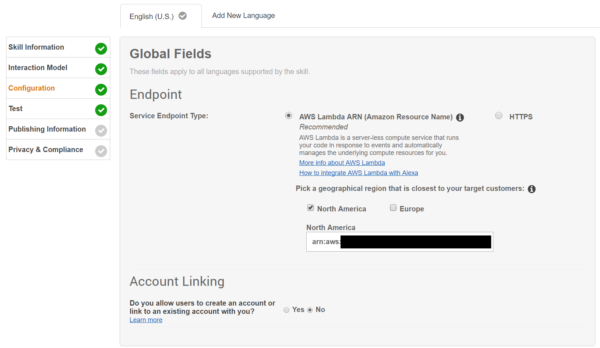

5. This is the "Test" page, where Alexa interactions can be tested without using actual voice invocations. First, enable the skill using the checkbox. Then, try some sample commands shown below.

	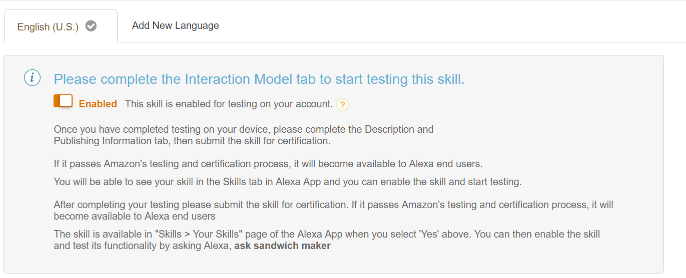

	The following commands orders a sandwich with lettuce and tomatoes delivered to bedroom. The second command confirms the order. If there are no errors, the Lambda Response should respond with a JSON object.

	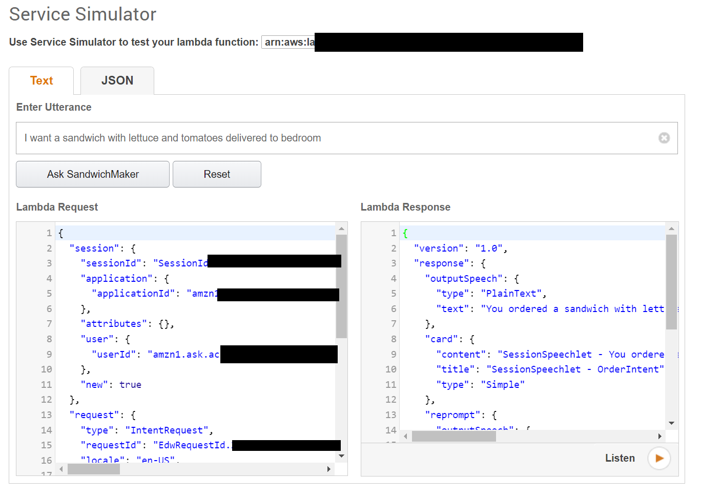
    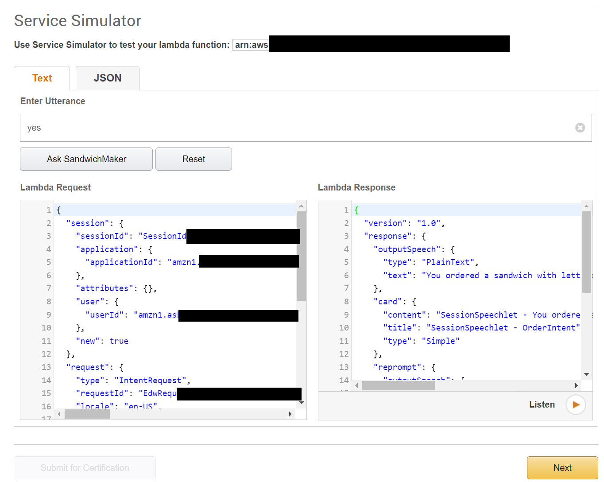


## <a name="sandwich_maker_server"></a>Sandwich Maker Mbed and Server Code

The mbed is used to move the servos to dispense the ingredients and bread. Mechanisms to dispense are TODO EXPLAIN. The mbed code responds to commands through RPC, sent via the USB virtual COM port. Another computer will run the python script to check the DynamoDB database and send the appropriate commands to the mbed.

### 2.1 Wiring Tables

TODO: Explain wiring and building the thing?

#### Wiring for Mbed and Servos
| mbed Pin |Servo        |
| -------- |------------:|
| p21      | Servo I1 Signal (yellow) |
| p22      | Servo I2 Signal (yellow) |
| p23      | Servo I3 Signal (yellow) |
| p24      | Servo I4 Signal (yellow) |
| p25      | Servo Bread Signal (yellow) |

#### Wiring for Power Supply to Mbed/Servos

| Power Supply | mbed / servos pin|
| -------- |------------:|
| GND      | mbed gnd     |
| GND      | Servo I1 GND (black/brown) |
| GND      | Servo I1 GND (black/brown) |
| GND      | Servo I1 GND (black/brown) |
| GND      | Servo I1 GND (black/brown) |
| GND      | Servo Bread GND (black/brown) |
| 5V       | mbed Vin  |
| 5V       | Servo I1 Power (red) |
| 5V       | Servo I2 Power (red) |
| 5V       | Servo I3 Power (red) |
| 5V       | Servo I4 Power (red) |
| 5V       | Servo Bread Power (red) |

### 2.2 Mbed Code Download

1. Mbed Code Download
	
	The mbed code can be imported to the compiler [here](https://developer.mbed.org/users/K2Silver/code/SandwichMaker/). Alternatively, the binary file is available at `/bin/SandwichMaker_LPC1768.bin`.

2. Test RPC Call
	To test RPC calls, first connect to the mbed using a USB cable. Use a serial program like RealTerm and open the virtual COM port connection with a baud rate of 9600. Send `/m_sand/run [integer]` through the serial connection, replacing `[integer]` with a number from 0 to 15. The number represents which ingredient to dispense.
	
	```
	/*  Bit 0 -> Ingredient 0 needed (1) or not (0) */
	/*  Bit 1 -> Ingredient 0 needed (1) or not (0) */
	/*  Bit 2 -> Ingredient 0 needed (1) or not (0) */
	/*  Bit 3 -> Ingredient 0 needed (1) or not (0) */
	```

3. Mbed Code Walkthrough (Optional Reading)

	This section explains the mbed code in more detail.
	
	The projects uses the `Servo.h` library and `mbed_rpc.h` library. The `Servo.h` library is useful for moving the servos to dispense ingredients and bread. The `mbed_rpc.h` library is used to handle RPC (Remote Procedure Calls) from the serial port.
	
	The `move_servos()` function sends out the signals to dispense the bread, each ingredient one by one, and finally another bread.
	
	```
	/* Make sandwich, using ingredient code */
	/*  Ingredient code is bit mask of ingredients needed */
	/*  Bit 0 -> Ingredient 0 needed (1) or not (0) */
	/*  Bit 1 -> Ingredient 0 needed (1) or not (0) */
	/*  Bit 2 -> Ingredient 0 needed (1) or not (0) */
	/*  Bit 3 -> Ingredient 0 needed (1) or not (0) */
	void move_servos(int ingr_code) {
	    /* Dispense bread */
	    servo_bread = 0; /* Dispense bread */
	    wait_ms(1000);
	    servo_bread = 1; /* Reset position */
	    wait_ms(1000);
	
	     /* Dispense ingredient 0 */
	    if (ingr_code & 0x1) {
	        servo_ingredient0 = 1; /* Open */
	        wait_ms(TIME_OPEN);
	        servo_ingredient0 = 0; /* Close */
	        wait_ms(TIME_AFTER_CLOSING);
	    }
	    /* Dispense ingredient 1 */
	    if (ingr_code & 0x2) {
	        servo_ingredient1 = 1; /* Open */
	        wait_ms(TIME_OPEN);
	        servo_ingredient1 = 0; /* Close */
	        wait_ms(TIME_AFTER_CLOSING);
	    }
	    /* Dispense ingredient 2 */
	    if (ingr_code & 0x4) {
	        servo_ingredient2 = 1; /* Open */
	        wait_ms(TIME_OPEN);
	        servo_ingredient2 = 0; /* Close */
	        wait_ms(TIME_AFTER_CLOSING);
	    }
	    /* Dispense ingredient 3 */
	    if (ingr_code & 0x8) {
	        servo_ingredient3 = 1; /* Open */
	        wait_ms(TIME_OPEN);
	        servo_ingredient3 = 0; /* Close */
	        wait_ms(TIME_AFTER_CLOSING);
	    }
	    /* Dispense bread again */
	    servo_bread = 0; /* Dispense bread */
	    wait_ms(1000);
	    servo_bread = 1; /* Reset position */
	    wait_ms(1000);
	}
	```
	
	Expose the function through RPC using the following code. The code declares a function `m_sand` that takes an integer argument and passes the argument to the `move_servos()` function declared earlier. For debugging purposes, the argument is output to the LEDs.
	
	```
	/* Declare function 'm_sand' exposed via RPC */
	void m_sand(Arguments *in, Reply *out);
	RPCFunction rpc_m_sand(&m_sand, "m_sand");
	void m_sand(Arguments *in, Reply *out)  {
	
	    /* Get argument */
	    int ingr_code = in->getArg<int>();
	
	    /* Output to LEDs for debugging */
	    mbed_leds = ingr_code;
	
	    /* Execute the function */
	    move_servos(ingr_code);
	
	    /* Set output */
	    out->putData("SandwichMade");
	
	    /* Reset LEDs */
	    mbed_leds = 0;    
	}
	```
	
	The main loop initializes the baud rate for the serial connection, sets up the buffers for the RPC calls, then loops forever to handle any RPC calls.
	
	```
	/* Main code */
	int main() {
	    /* Set pc serial baud rate */
	    pc.baud(9600);
	
	    // receive commands, and send back the responses
	    char buf[256], outbuf[256];
	
	    while(1) {
	        /* Wait for command */
	        while (!pc.readable()) {
	            wait_ms(100);
	        }
	        /* Read the characters into string array */
	        int i = 0;
	        while (pc.readable()) {
	            buf[i] = pc.getc();
	            i++;
	        }
	        buf[i] = '\n';
	        pc.printf("%s", buf);
	        //Call the static call method on the RPC class
	        RPC::call(buf, outbuf);
	        pc.printf("%s\n", outbuf);
	        /* Flush pc serial buffer */
	        while (pc.readable()) {
	            pc.getc();
	        }
	    }
	
	}
	```

#### 2.3 Sandwich Maker Server

The source code for the sandwich maker server is locaterd in `/src/sandwich_maker`. Clone or download the repository to access the files. The computer that runs the server will control the mbed via RPC.

1. Install Python libraries
	
	The sandwich maker server is written in Python and requires certain libraries.
	
	* `boto3` library: install with `pip install boto3`
		- Used to authenticate and access DynamoDB hosted on Amazon
	* `pyserial` library: install with `pip install pyserial`
		- Used to send serial RPC commands to the mbed

2. Configure DynamoDB Key and Password

	To connect to the DynamoDB server hosted on Amazon, the key, passphrase, and region are all necessary. The source code in `/src/sandwich_maker` includes a `config_template.json` file with the following code:
	
	```
	{
	  "AWS_KEY":"YOUR_AWS_KEY_HERE",
	  "AWS_PASS":"YOUR_AWS_PASS_HERE",
	  "DYNAMODB_REGION":"YOUR_REGION_HERE"
	}
	```
	
	Replace `YOUR_AWS_KEY_HERE` and `YOUR_AWS_PASS_HERE` with the IAM access key ID and secret password copied from the DynamoDB user setup section. More information can be obtained from the [IAM console](https://docs.aws.amazon.com/AWSSimpleQueueService/latest/SQSGettingStartedGuide/AWSCredentials.html). Use `us-east-1` for `YOUR_REGION_HERE` (since Amazon Alexa seems to only support this region reliably). Then, rename the `config_template.json` to `config.json`. This file will be used in the python code to authenticate itself to the DynamoDB database.

3. COM Port Configuration
	
	In the Python code, change the `COM_PORT = 'COM4'` to match the COM port of the mbed. The COM port number can be verified by RealTerm or other terminal applications.

4. Python Sandwich Maker Server Walkthrough (Optional Reading)

	The code for the sandwich maker server (which issues commands to the mbed via RPC) is written in Python. The server code relies heavily on `boto3` library, which allows API calls to the Amazon DynamoDB database.
	
	The following are the table column names. `CustomerId` is used as the primary key.
	
	```
	# Column names for table
	COL_CUSTOMERID = 'CustomerId'
	COL_INGREDIENTS = 'Ingredients'
	COL_TIMESTAMP = 'Timestamp'
	COL_LOCATION = 'Location'
	COL_STATUS = 'OrderStatus'
	```
	
	The following are constants used for the `OrderStatus` column in the database.
	
	```
	# Constants for table
	STATUS_PENDING = 'pending'
	STATUS_WAITING = 'waiting'
	STATUS_DELIVERING = 'delivering'
	```
	
	To access the DynamoDB database, read in the configuration file and open a new session using the key and password.
	
	```
	# DynamoDB Access information
	# Read key information from config file
	with open('config.json') as json_data_file:
	    config_data = json.load(json_data_file)
	AWS_KEY = config_data['AWS_KEY']
	AWS_PASS = config_data['AWS_PASS']
	DYNAMODB_REGION = config_data['DYNAMODB_REGION']
	DYNAMODB_ENDPOINT_URL = 'https://dynamodb.aws-east-1.amazonaws.com'
	dynamodb_session = Session(aws_access_key_id=AWS_KEY,
	              aws_secret_access_key=AWS_PASS,
	              region_name=DYNAMODB_REGION)
	dynamodb = dynamodb_session.resource('dynamodb')
	```
	
	The list of ingredients allowed are defined in the server code, along with a parser function to extract the ingredients and convert to an integer code.
	
	```
	# Helper function to parse list of ingredients and conver to code for dispenser
	ingredients_valid = ['lettuce', 'tomatoes', 'cheese', 'onions']
	ingredient_value = {
	    'lettuce': 1,
	    'tomatoes': 2,
	    'cheese': 4,
	    'onions': 8
	}
	```
	
	The Python code below sends the RPC command after parsing the ingredient string.
	
	```
	# Dispatch order by sending commands to microcontroller
	def dispatch_order(order):
	    print ("Sandwich with " + order[COL_INGREDIENTS] + " delivering to " + order[COL_LOCATION])
	    ingredient_code = parse_ingredients(order[COL_INGREDIENTS])
	    print ("Running command \"/m_sand/run " + str(ingredient_code) + "\"")
	    ser.write("/m_sand/run " + str(ingredient_code))
	    response = ser.readline()
	    print (response) # Wait until mbed resopnds that sandwich is made
	    while ("Made sandwich" not in response):
	        response += ser.readline()
	        time.sleep(1)
	        print (response)
	    print ("Done making sandwich")
	```
	
	This function is called in the main loop to get the next order and dispatch it to the mbed. If the mbed successfully receives and executes the RPC call, then the code below updates the status from `pending` to `waiting`, which will allow the robot to notice that a sandwich is ready to be delivered.
	
	```
	# Send next order by dispatching order to microcontroller and updating status
	def send_next_order():
	    json_response = table_get_all_orders()
	    num_orders = json_response['Count'];
	    if (num_orders != 0):
	        print ("Found next order ...")
	        next_order = find_next_order(json_response["Items"])
	
	        # Dispatch order to dispenser
	        dispatch_order(next_order)
	
	        # Update status of order to delivering
	        next_order[COL_STATUS] = STATUS_WAITING
	        update_order(next_order)
	
	        # Return true if order updated successfully
	        return True
	    else: # Else, return false
	        return False
	```
	
	The main code opens a serial connection with a baud rate of 9600. Change the com port value from `COM4` to whatever COM port that the mbed connects to.
	
	```
	# Attempt to open serial connection
	ser = serial.Serial()
	ser.baudrate = 9600
	ser.port = 'COM4'
	ser.open()
	if(not ser.is_open):
	    print("Error opening COM port")
	    sys.exit(1)
	```
	
	After opening a serial connection, loop forever until a keyboard interrupt (Ctrl-C). In the loop, check for new orders from the database, waiting 10 seconds in between checks to not overload the server.
	
	```
	# Main loop that checks for orders and executes them
	try:
	    while True:
	    # Check if delivering any orders
	    # If not, send a new order
	        if (not is_delivering_order()):
	            send_next_order()
	            print ("Order sent ...")
	        else:
	            print ("Delivering now ...")
	        time.sleep(10) # sleep for 10 seconds (not overload database server)
	
	# Keyboard interrupt (Ctrl-C) pressed, exit program
	except KeyboardInterrupt:
	    ser.close()
	    print ("Exited Program\n")
	    sys.exit(0)
	```

##  3. <a name="roomba_create_robot"></a>Roomba Create 2 C# Application

The delivery robot used for the project was the Roomba Create 2. A computer was mounted on the robot to communicate with the online DynamoDB and send commands to the robot. The following section describes the setup process for running the C# application that manages those actions. Clone or download the `/src/DeliveryRobot` directory.

### 3.1 Python Setup

1. The C# application relies on python scripts to access the DynamoDB database. This is to simplify the C# application, since it will not have to import the AWS SDK. However, certain Python libraries must be installed.
	
	* `boto3` library: install with `pip install boto3`
		- Used to authenticate and access DynamoDB hosted on Amazon
	* `pyserial` library: install with `pip install pyserial`
		- Used to send serial commands to the Create 2 robot

	**Note that these commands require `pip` to be installed. Check [here](https://pip.pypa.io/en/stable/installing/) for more information regarding pip.**

2. Configure DynamoDB Key and Password

	To connect to the DynamoDB server hosted on Amazon, the key, passphrase, and region are all necessary. The source code in `/src/DeliveryRobot` includes a `config_template.json` file with the following code:
	
	```
	{
	  "AWS_KEY":"YOUR_AWS_KEY_HERE",
	  "AWS_PASS":"YOUR_AWS_PASS_HERE",
	  "DYNAMODB_REGION":"YOUR_REGION_HERE"
	}
	```
	
	Replace `YOUR_AWS_KEY_HERE` and `YOUR_AWS_PASS_HERE` with the IAM access key ID and secret password copied from the DynamoDB user setup section. More information can be obtained from the [IAM console](https://docs.aws.amazon.com/AWSSimpleQueueService/latest/SQSGettingStartedGuide/AWSCredentials.html). Use `us-east-1` for `YOUR_REGION_HERE` (since Amazon Alexa seems to only support this region reliably). Then, rename the `config_template.json` to `config.json`. This file will be used in the python code to authenticate itself to the DynamoDB database.

### 3.2 C# Application Setup

1. The C# application is built using Visual Studio. Open the Visual Studio project `/src/DeliveryRobot/DeliveryRobot.sln` and build the project. All of the code to run the Python scripts are contained in the project.

# Running the Program

## 1. Run Python Sandwich Maker Server

Run the `sandwich_maker.py` file from the `/src/sandwich_maker` directory. Make sure that `COM_PORT` variable in the Python script matches the COM port number of the mbed. Ensure that the `config.json` has the correct key and password to access the DynamoDB database.

TODO: SCREENSHOT CORRECT BEHAVIOR

## 2. Start Robot Application

Connect the computer running the C# application to the Create 2 robot using the provided USB connector. Build and start the C# GUI Application DeliveryRobot using Visual Studio.

TODO: SCREENSHOT CORRECT BEHAVIOR

Select the correct COM Port from the dropdown menu.

TODO: SCREENSHOT

Enter "Row" and "Column" values for the map of the area. Click "Generate". This generates a matrix of square buttons as shown below.

TODO: SCREENSHOT AFTER GENERATE

Clicking on a square turns it into a dark square, which represents a wall. Clicking on it again will turn it into a "Start" or "Finish" block. There can only be one "Start" block, which designates the location of the sandwich maker. There can be multiple "Finish" blocks, depending on how many destinations are allowed. Since these maps become tedious to generate, the "Export" button allows saving maps as text maps. These maps can then be imported later using the "Import" button.

TODO: SCREENSHOTS FOR SELECTING START AND FINISH

Click the "Start" button. The Python script should run every 10 seconds (which opens a python script window) to check for any updates to the DynamoDB database.

## 3. Alexa Interaction

TODO: Diagram showing the interaction methods.

## Gallery
TODO: Post gallery

## Videos
TODO: Post working video

## FAQ
* Connecting to GTother TODO

